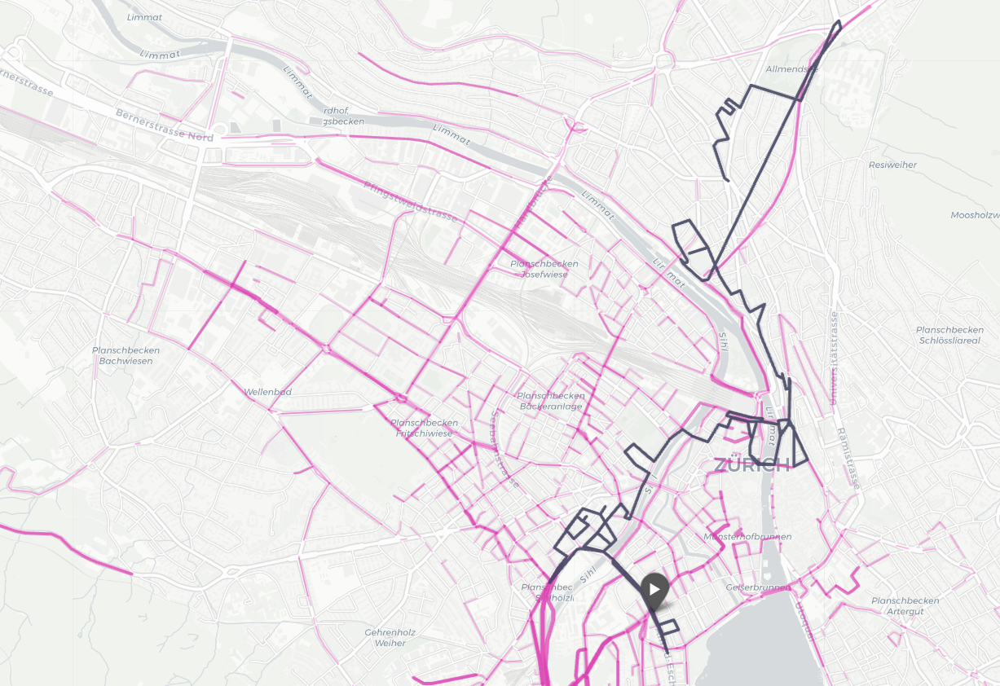

# Unbekannte Wege

Visualize your Google Maps location history and discover the streets you've never walked. The notebook maps your movement patterns onto the city's road network, then generates a suggested route through your least-used streets.



## What it does

1. Parses your Google Maps Timeline export (supports both Android and iOS formats)
2. Filters points to a city bounding box
3. Snaps GPS points to the nearest street edges using OSMnx
4. Scores every street segment by how often you've used it
5. Renders an interactive map: street width/opacity scales with usage frequency
6. Generates a walking/driving route through the streets you've used least

## Requirements

```
pip install pandas osmnx folium ipyleaflet ipywidgets tqdm requests selenium
```

Selenium also requires a Chrome driver matching your Chrome version.

## Usage

1. Export your Timeline data from Google Maps (see instructions in the notebook)
2. Save the file as `Timeline.json` in the same directory as the notebook
3. Set your city and preferences in the **Settings** cell
4. Run all cells top to bottom (or resume from the pickle checkpoint after the snapping step)

## Settings

| Variable | Default | Description |
|---|---|---|
| `city` | `"Zürich, Switzerland"` | City to analyze — any Nominatim-resolvable name |
| `networktype` | `"drive"` | `"drive"` (faster) or `"walk"` (more precise for pedestrian data) |
| `stepsize` | `20` | Skip every N points when snapping — increase to speed things up |
| `FILENAME` | `"Timeline.json"` | Path to your exported timeline file |

## Output

- `{city}_map.html` — interactive dot map of all your recorded locations
- `least_used_map.html` — street heatmap + suggested least-used route
- `least_used_map.pdf` — PDF export of the above (requires Selenium)
- `edge_counts.pkl` — cached street-usage counts (lets you skip re-snapping)

## Privacy note

Your `Timeline.json` contains detailed location history — keep it out of version control. Add it to `.gitignore`:

```
Timeline.json
*.pkl
*.html
*.pdf
```
